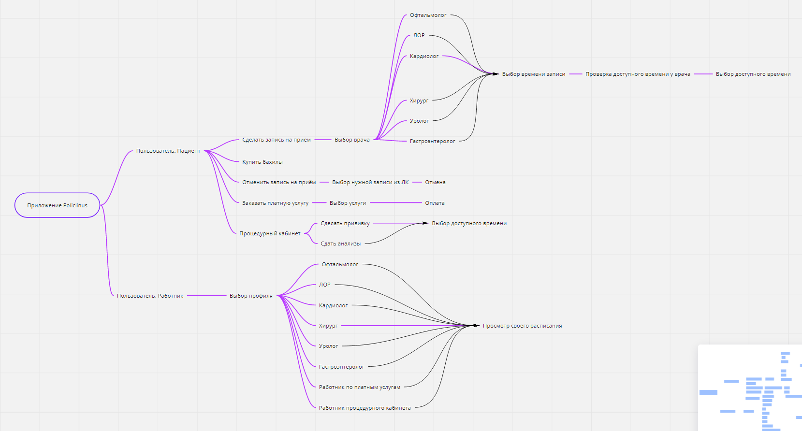

# Медицинская система "Policlinus"

## Cхема приложения 

**Имеется две основных класса: пациент и работник.**

**Класс Работник может иметь 8 различных ролей:**
- Офтальмолог
- ЛОР
- Кардиолог
- Хирург
- Уролог
- Гастроэнтеролог
- Работник по платным услугам
- Работник процедурного кабинета

**А в классе Пациент имеется 5 различных действий:**
- Сделать запись на приём
- Отменить запись на приём
- Купить бахилы
- Заказать платную услугу
- Процедурный кабинет
  - Сделать прививку
  - Сдать анализы
